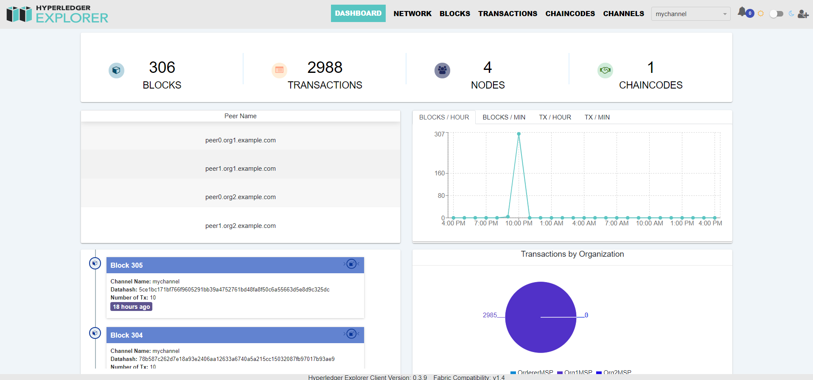
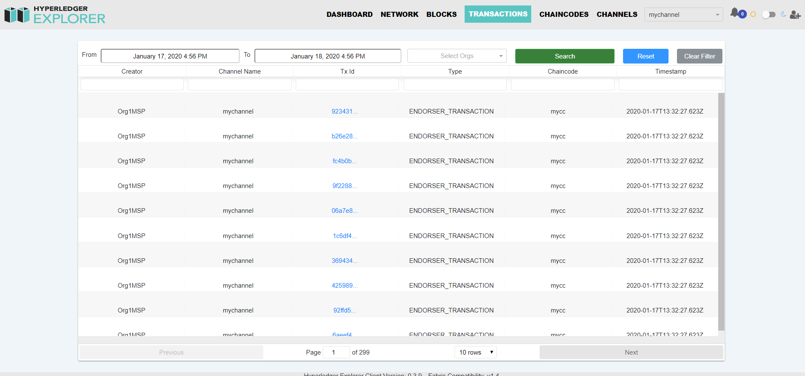
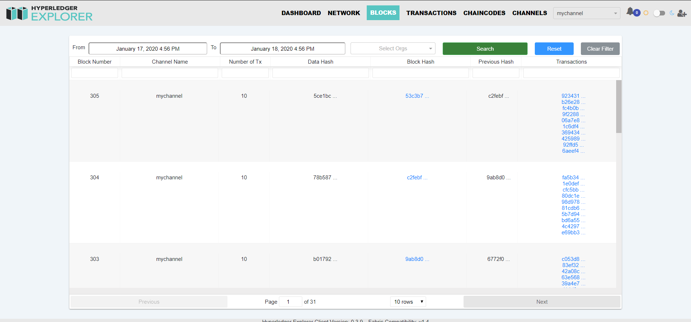
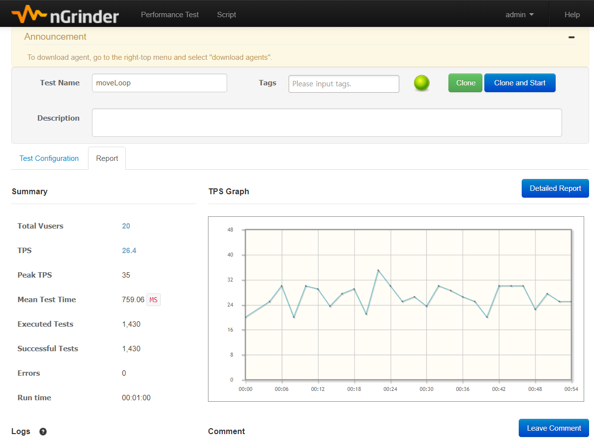

# 블록체인 네트워크 통합 모니터링 시스템

국외뿐만 아니라 국내에서도 기업들간의 프라이빗 블록체인 기술이 많은 사업에 적용되고 있습니다. 올해는 국내에 블록체인 기반의 상용서비스가 다수 오픈하기도 하였습니다. 다수의 기업들이 참여하여 구축된 블록체인 네트워크를 통합 모니터링하기 위한 적절한 서비스가 부족합니다. 결국 각 참여사에서 자신들의 블록체인 노드만 모니터링하는 것이 현실입니다.

본 프로젝트에서는 프라이빗 블록체인 네트워크에 대한 통합관점의 모니터링 서비스를 개발합니다.

## 0 특징

* 블록체인 네트워크에 포함된 모든 노드를 한 곳에서 통합적으로 관제합니다.
* 네트워크의 트랜잭션과 블록 정보를 한 것에서 조회할 수 있습니다.
* 노드 다운 시 알람 이벤트 발생으로 즉각 대응할 수 있습니다.
* 분당 트랜잭션 발생을 모니터링하여 비정상 트래픅을 감지합니다.

## 스크린샷
### 0.1 메인화면

### 0.2 트랜잭션

### 0.3 블록

### 0.4 성능테스트


## 1. 네트워크 올리기

### 1.1 /etc/hosts 수정
사용할 모든 서버의 노드의 /etc/hosts를 수정합니다.
```
centos@peerNode2$ sudo vi /etc/hosts
172.31.34.29 peer0.org1.example.com
172.31.34.29 peer1.org1.example.com
172.31.34.29 couchdb0
172.31.34.29 couchdb1
172.31.34.29 cli

172.31.40.93 peer0.org2.example.com
172.31.40.93 peer1.org2.example.com
172.31.40.93 couchdb2
172.31.40.93 couchdb3

172.31.39.23 orderer.example.com
172.31.39.23 zookeeper0
172.31.39.23 kafka0.example.com
172.31.39.23 ca0.org1.example.com
172.31.39.23 ca1.org2.example.com

172.31.44.81 orderer2.example.com
172.31.44.81 zookeeper1
172.31.44.81 kafka1.example.com

172.31.38.221 orderer3.example.com
172.31.38.221 zookeeper2
172.31.38.221 kafka2.example.com
172.31.38.221 kafka3.example.com

172.31.47.17 explorer.mynetwork.com
```

### 1.2 extra_host 설정
제공되는 각 node의 dcoekr-compose의 extra_host의 ip를 각 컨테이너의 host ip에 맞게 수정한다.

### 1.3 인증서 생성 및 배포
step.sh를 활용하여 제공되는 각 node의 dcoekr-compose의 extra_host의 ip를 서버 ip에 맞게 수정한다.
인증서와 artifacts
```
centos@peerNode2$ cd {your-fabric-samples-path}/peerNode1/
cnetos@peerNode2$ ./step1.sh
```

* 오더러 노드 1에 ca 컨테이너 2개를 올린다.
### 1.4 CA 컨테이너 올리기 (오더러 노드 1)
```
centos@ordererNode1$ cd {your-fabric-samples-path}/peerNode1/
cnetos@ordererNode1$ ./up-ca.sh
```

### 1.5 kafka 컨테이너 올리기 (오더러 노드 1,2,3)
오더러 노드 1,2,3에 각각 zookeeper 컨테이너와 kafka 컨테이너를 한개씩 올린다.(orderer 3은 카프카 컨테이너 2개)

* 오더러 노드 1
```
centos@ordererNode1$ cd {your-fabric-samples-path}/ordererNode1/
cnetos@ordererNode1$ ./up-mq.sh
```

* 오더러 노드 2
```
centos@ordererNode2$ cd {your-fabric-samples-path}/ordererNode2/
cnetos@ordererNode2$ ./up-mq.sh
```

* 오더러 노드 3
```
centos@ordererNode3$ cd {your-fabric-samples-path}/ordererNode3/
cnetos@ordererNode3$ ./up-mq.sh
```

### 1.6 orderer 컨테이너 올리기 (오더러 노드 1)
오더러 노드 1,2,3에 각각 orderer 컨테이너를 한 개씩 올린다.

* 오더러 노드 1
```
centos@ordererNode1$ cd {your-fabric-samples-path}/ordererNode1/
cnetos@ordererNode1$ ./up-orderer.sh
```

* 오더러 노드 2
```
centos@ordererNode2$ cd {your-fabric-samples-path}/ordererNode2/
cnetos@ordererNode2$ ./up-orderer.sh
```

* 오더러 노드 3
```
centos@ordererNode3$ cd {your-fabric-samples-path}/ordererNode3/
cnetos@ordererNode3$ ./up-orderer.sh
```

### 1.7 couchdb 컨테이너 올리기 (피어 노드 1,2)
피어 노드 1,2 에 couchdb 컨테이너를 각각 2개씩 올린다.
* 피어 노드 1
```
centos@peerNode1$ cd {your-fabric-samples-path}/peerNode1/
cnetos@peerNode1$ ./up-couch.sh
```

* 피어 노드 2
```
centos@peerNode2$ cd {your-fabric-samples-path}/peerNode2/
cnetos@peerNode2$ ./up-couch.sh
```

### 1.8 peer 컨테이너 올리기 (피어 노드 1)
피어 노드 1,2 에 peer 컨테이너를 각각 2개씩 올린다.
* 피어노드1
```
centos@peerNode1$ cd {your-fabric-samples-path}/peerNode1/
cnetos@peerNode1$ ./up-peer.sh
```

* 피어노드2
```
centos@peerNode2$ cd {your-fabric-samples-path}/peerNode2/
cnetos@peerNode2$ ./up-peer.sh
```

### 1.9 cli 컨테이너 올리기 (피어 노드 1, 2)
피어 노드 1,2 에 cli 컨테이너를 각각 1개씩 올린다.
* 피어노드 1
```
centos@peerNode1$ cd {your-fabric-samples-path}/peerNode1/
cnetos@peerNode1$ ./up-cli.sh
```

* 피어노드 2
```
centos@peerNode2$ cd {your-fabric-samples-path}/peerNode2/
cnetos@peerNode2$ ./up-cli.sh
```

### 1.10 체인코드 설치 및 초기화  (피어 노드 1, 2)
피어 노드에 체인코드 설치, 인스턴스화하는 스크립트를 실행한다.
* 피어노드 1
```
centos@peerNode1$ docker exec -it cli /bin/bash
cnetos@peerNode1$ cd channel-artifacts
cnetos@peerNode1$ cd ./init.sh
```

* 피어노드 2
```
centos@peerNode2$ docker exec -it cli /bin/bash
cnetos@peerNode2$ cd channel-artifacts
cnetos@peerNode2$ cd ./init.sh
```

## 2. API 서버 연동
* api 서버 노드의 설정 파일에서 앞서 구축한 network에 맞게 인증서 경로를 설정한다.
```
centos@apiServer$ cd {your-fabric-samples-path}/apiServer/
cnetos@apiServer$ vi artifacts/network-config-kafka.yaml
adminPrivateKey:
  path: artifacts/kafka-artifacts/crypto-config/peerOrganizations/org1.example.com/users/Admin@org1.example.com/msp/keystore/722243198a318cc84dbebb72b1b2d9b3635964ae287071117517f2f116fda4bf_sk
signedCert:
  path: artifacts/kafka-artifacts/crypto-config/peerOrganizations/org1.example.com/users/Admin@org1.example.com/msp/signcerts/Admin@org1.example.com-cert.pem
```

* 스크립트를 이용하여 api 서버를 실행한다.
```
centos@apiServer$ cd {your-fabric-samples-path}/apiServer/
centos@apiServer$ ./runKafkaApp.sh
```

## 3. Hyperledger Explorer 연동

* explorer 서버 노드의 설정 파일에서 앞서 구축한 network에 맞게 인증서 경로를 설정한다.
```
centos@apiServer$ cd {your-fabric-samples-path}/monitoringServer/

...
"Org1MSP": {
        "mspid": "Org1MSP",
        "fullpath": true,
        "adminPrivateKey": {
                "path": "/tmp/crypto/peerOrganizations/org1.example.com/users/Admin@org1.example.com/msp/keystore/1d8113c46f29180b0204489123e741cd2ee86f5f4e5adc95571f9e5310eac83a_sk"
        },
        "signedCert": {
                "path": "/tmp/crypto/peerOrganizations/org1.example.com/users/Admin@org1.example.com/msp/signcerts/Admin@org1.example.com-cert.pem"
        }
}
...
```

* Hyperledger explorer docker를 실행한다.
```
centos@monitoringServer$ cd {your-fabric-samples-path}/monitoringServer
centos@monitoringServer$ docker-compose -f docker-compose.yaml up -d

```

* localhost:8090에 접속에 웹페이지가 정상적으로 동작하는지 확인한다.

## 4. Modified Balance Transfer(API 서버 api 호출 방법)

API 명세 : https://app.swaggerhub.com/apis-docs/wonpyoJang/ModifiedBalanceTrnasfer/1.0.0

### 사전준비
* 기존 docker 컨테이너나 이미지가 있다면 삭제하는 것이 좋다.
```
docker rm -f $(docker ps -aq)
docker rmi -f $(docker images -q)
```

### Node.js rest-api 서버 실행

##### 콘솔창 1 에서 아래 명령어 입력

* docker-compose로 네트워크 시작

```
docker-compose -f artifacts/docker-compose.yaml up
```
##### 콘솔창 2 에서 아래 명령어 입력
* fabric-client와 fabric-ca-client 설치
```
npm install
```
* 4000번 포트로 node app 시작
```
PORT=4000 node app
```

##### 콘솔창 3

* test 스크립트 수행

```
./testAPIs.sh -l node
```
만약 instanciate 부분에서 timeout 에러가 발생한다면 위 스크립트를 재차 실행해 보자.

### api 사용법.

* 토큰 환경변수에 저장
```
ORG1_TOKEN=$(curl -s -X POST \
  http://localhost:4000/users \
  -H "content-type: application/x-www-form-urlencoded" \
  -d 'username=Jim&orgName=Org1')

ORG1_TOKEN=$(echo $ORG1_TOKEN | jq ".token" | sed "s/\"//g")

ORG2_TOKEN=$(curl -s -X POST \
  http://localhost:4000/users \
  -H "content-type: application/x-www-form-urlencoded" \
  -d 'username=Barry&orgName=Org2')

ORG2_TOKEN=$(echo $ORG2_TOKEN | jq ".token" | sed "s/\"//g")
```

* move 함수 실행 (a에서 b로 10만큼 송금)
```
curl -s -X POST \
  http://localhost:4000/channels/mychannel/chaincodes/mycc \
  -H "authorization: Bearer $ORG1_TOKEN" \
  -H "content-type: application/json" \
  -d '{
	"peers": ["peer0.org1.example.com","peer0.org2.example.com"],
	"fcn":"move",
	"args":["a","b","10"]
}'
```

* swap 함수 실행 (a와 b의 값을 뒤바꾸기)
```
curl -s -X POST \
  http://localhost:4000/channels/mychannel/chaincodes/mycc \
  -H "authorization: Bearer $ORG1_TOKEN" \
  -H "content-type: application/json" \
  -d '{
	"peers": ["peer0.org1.example.com","peer0.org2.example.com"],
	"fcn":"swap",
	"args":["a","b"]
}'
```

* set 함수 실행 (a의 값을 1000으로 설정)
```
curl -s -X POST \
  http://localhost:4000/channels/mychannel/chaincodes/mycc \
  -H "authorization: Bearer $ORG1_TOKEN" \
  -H "content-type: application/json" \
  -d '{
	"peers": ["peer0.org1.example.com","peer0.org2.example.com"],
	"fcn":"set",
	"args":["a","1000"]
}'
```

* query 함수 실행 (a의 값을 확인)
```
curl -s -X GET \
  "http://localhost:4000/channels/mychannel/chaincodes/mycc?peer=peer0.org1.example.com&fcn=query&args=%5B%22a%22%5D" \
  -H "authorization: Bearer $ORG1_TOKEN" \
  -H "content-type: application/json"
```

* query 함수 실행 (b의 값을 확인)
```
curl -s -X GET \
  "http://localhost:4000/channels/mychannel/chaincodes/mycc?peer=peer0.org1.example.com&fcn=query&args=%5B%22b%22%5D" \
  -H "authorization: Bearer $ORG1_TOKEN" \
  -H "content-type: application/json"
```
